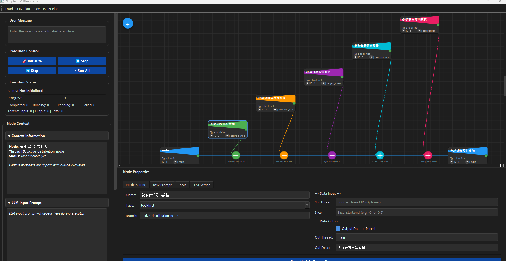

# llm-linear-executor


llm-linear-executor 一个专为 LLM 设计的轻量级线性任务执行引擎。它通过上下文隔离和灵活的节点调度，将复杂的工作流转化为可管理的顺序执行步骤。

---
## llm-linear-executor可以做什么？

1. llm-linear-executor 完全由数据驱动，对于简单的任务，不需要再写代码（如编写，langgraph等），直接通过编写json文件，即可以快速验证一个workflow是否可行
2. 可以通过接入tools，来接入自己项目的数据！这个也是做这个项目的初衷！为了验证和调试一个workflow的prompt，通常需要接入数据和工具。为llm-linear-executor提高tools_map,来实现这一点。
3. llm-linear-executor 支持使用llm自动生成plan(json文件)；通过调用plan_generator()函数，可以快速生成一个plan(json文件) 
4. 可以使用[simple-llm-playground](https://github.com/nikonikoni4/simple-llm-playground.git)(一个基于llm-linear-executor的qt界面，通过可视化快速生成和调试workflow)；
<p align="center">图 ：example.json在simple-llm-playground中的可视化</p>




### 局限性
1. 目前plan_generator()只是用一个简单的prompt，生成plan.json文件，效果一般，但可以把ExecutionPlan类的定义导出（parser = PydanticOutputParser(pydantic_object=ExecutionPlan) parser.get_format_instructions()），使用其他更强大的模型生成更好的plan，用于快速迭代流程
2. 当前只有两种节点llm-first和tool-first，缺少router节点，有些情况下只能多创建一条线程，来实现。（在后续更新中会思考解决这个问题）

## 快速开始

### example1

```python
python example/example1/example.py
```

### example2

1. 导入或编写tools
```python
from langchain_core.tools import tool

@tool
def add(a: int, b: int) -> int:
    """Add two integers."""
    return a + b
```

2. 编写plan.json (支持多模版)
```json
{
  "simple_calc": {
    "task": "计算任务",
    "nodes": [
      {
        "node_type": "llm-first",
        "node_name": "Calculator",
        "thread_id": "main",
        "task_prompt": "Please calculate 10 + 20 using the tool.",
        "tools": ["add"],
        "tools_limit": {"add": 5},
        "enable_tool_loop": true
      }
    ]
  }
}
```

3. 使用plan
```python
from langchain_openai import ChatOpenAI
from llm_linear_executor.executor import Executor
from llm_linear_executor.load_plans import load_plan_from_template
__file__ = os.path.dirname(os.path.abspath(__file__))
# 准备依赖
tools_map = {"add": add}

# 定义 LLM 工厂函数 (Executor 内部会调用此函数创建 LLM 实例)
from llm_linear_executor.llm_factory import create_llm_factory
# api_key = "your_api_key"
# model = "gpt-4o"
# llm_factory = create_llm_factory(model,api_key,chat_model=ChatOpenAI)
llm_factory = create_llm_factory(chat_model=ChatOpenAI)

# 加载指定模版
# 注意：第二个参数 "simple_calc" 对应 json 中的 key
plan = load_plan_from_template(os.path.join(__file__, "example2.json"), "simple_calc")

# 3. 执行
executor = Executor( 
    plan=plan, 
    user_message="Start calculation",
    tools_map=tools_map,
    llm_factory=llm_factory
)

result = executor.execute()
print(f"最终结果: {result['content']}")
```

## 节点说明

### 1. 节点 Schema 定义

| 字段 | 类型 | 必填 | 说明 |
| :--- | :--- | :--- | :--- |
| `node_type` | `str` | 是 | 节点类型: `"llm-first"` 或 `"tool-first"` |
| `node_name` | `str` | 是 | 节点名称，用于日志记录和调试 |
| `thread_id` | `str` | 是 | 当前节点运行所在的线程ID |
| `task_prompt` | `str` | 否 | LLM的任务描述 (Prompt) |
| `tools` | `list[str]` | 否 | 该节点可调用的工具名称列表 |
| `enable_tool_loop` | `bool` | 否 | 是否允许LLM多次循环调用工具 (默认 False) |
| `tools_limit` | `dict` | 否 | 工具调用次数限制配置, 例如 `{"web_search": 1}` |
| `initial_tool_name` | `str` | **tool-first必填** | 指定初始执行的工具名称 |
| `initial_tool_args` | `dict` | 否 | 初始工具调用的参数 |
| `data_in_thread` | `str` | 否 | 输入数据来源的线程ID (默认 main) |
| `data_in_slice` | `list` | 否 | 输入消息的切片范围 `[start, end)` (默认取最后一条) |
| `data_out` | `bool` | 否 | 是否将节点执行结果输出 (默认 False) |
| `data_out_thread` | `str` | 否 | 输出结果合并到的目标线程ID (默认 main) |
| `data_out_description`| `str` | 否 | 输出结果的描述前缀 |

### 2. 节点类型与特殊行为

| 节点类型 | 执行逻辑 | `task_prompt` 为空时的行为 | 说明 |
| :--- | :--- | :--- | :--- |
| **`llm-first`** | LLM思考 → 调用工具(可选) | **空节点** | 仅执行数据流操作(data_in搬运/data_out输出)，**不进行任何LLM推理**。常用于跨线程搬运数据。 |
| **`tool-first`** | 执行指定工具 → LLM分析结果 | **纯工具节点** | 仅执行 `initial_tool_name` 指定的工具，并将结果存入历史。**不进行后续的LLM分析**。 |


## 执行顺序
按照节点顺序执行，必须一个节点完成之后才能继续下一个节点

## 数据流机制

执行器的数据流完全由以下四个配置项决定：

| 配置项 | 作用 | 默认值 |
|--------|------|--------|
| `data_in_thread` | 指定输入数据来源线程ID | `main` |
| `data_in_slice` | 指定消息切片范围 `[start, end)` | 取最后一条消息 |
| `data_out` | 是否将结果输出到data_out字典 | `False` |
| `data_out_thread` | 指定输出合并的目标线程ID | `main` |
| `data_out_description` | 输出内容的描述前缀 | `""` |

### 1. 数据输入 (data_in)

**触发时机：只在新线程创建时执行一次**

```python
def _create_thread(self, thread_id: str, node: NodeDefinition | None = None):
    if thread_id in self.context["messages"]:
        return  # 线程已存在，直接返回

    # 确定数据来源线程
    source_thread = node.data_in_thread or self.main_thread_id  # 默认 main

    # 获取消息切片
    if node.data_in_slice:
        injected = source_msgs[start:end]  # 使用指定切片
    else:
        injected = [source_msgs[-1]]       # 默认取最后一条
```

**示例：**

| 节点 | 线程状态 | data_in_thread | data_in_slice | 效果 |
|------|----------|----------------|---------------|------|
| n1 | 新线程创建 | `"main"` | `None` | ✅ 注入main的最后一条消息 |
| n2 | 线程已存在 | `"other"` | `[0,2]` | ❌ 被忽略（线程已存在） |

### 2. 数据输出 (data_out)

**流程：设置 data_out → 合并到目标线程**

```python
# 节点执行后
if node.data_out:
    # 1. 设置输出
    self._set_data_out(thread_id, node_type, description, content)

    # 2. 合并到目标线程
    target_thread = node.data_out_thread or self.main_thread_id  # 默认 main
    self._merge_data_out(thread_id, target_thread)
```

**示例：**

| 节点 | data_out | data_out_thread | 操作 |
|------|----------|-----------------|------|
| n1 | `True` | `"main"` | 设置data_out → 合并到main |
| n2 | `False` | `"main"` | 不执行任何输出操作 |
| n3 | `True` | `"other"` | 设置data_out → 合并到other |

### 3. 完整数据流示例

```
main线程: [用户消息]
    │
    ├── n1: thread_id="q1", data_in_thread="main", data_out=True, data_out_thread="main"
    │       → 从main注入最后一条消息到q1
    │       → 执行完成后，将q1的结果合并到main
    │
    ├── n2: thread_id="q1", data_in_thread="main" (被忽略，线程已存在)
    │       → 继续在q1上执行
    │
    └── n3: thread_id="q2", data_in_thread="q1", data_out=True, data_out_thread="main"
            → 从q1注入最后一条消息到q2
            → 执行完成后，将q2的结果合并到main
```

### 重要特性

1. **data_in 只在新线程创建时生效**：同一线程只有第一个节点会执行data_in逻辑
2. **data_out 每个节点独立控制**：每个节点可独立决定是否输出及输出目标
3. **没有"父线程"概念**：线程间数据流动完全由 `data_in_thread` 和 `data_out_thread` 显式配置
4. **灵活的目标选择**：同一节点的输出可以合并到任意线程（不限于main）
